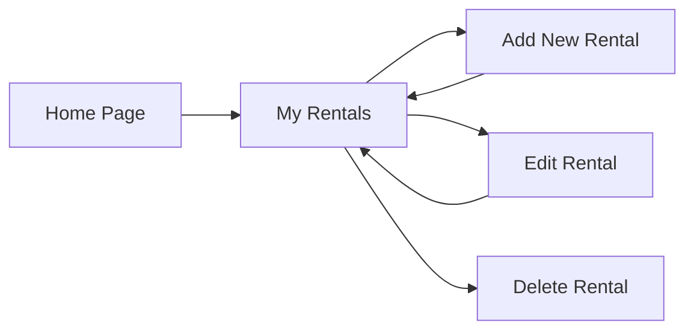

<div align="center">


Your Personal Rentals Tracker

*Smart renting made simple — manage your boarding house details with ease*

[](https://github.com)
[](https://developer.mozilla.org/en-US/docs/Web/API/Window/localStorage)
[](https://github.com)

[Features](#-features) • [Tech Stack](#-tech-stack) • [Getting Started](#-getting-started) • [Roadmap](#-roadmap)

</div>

---

##  About

**RentEase** is a lightweight, client-side CRUD application built for students and renters who need a straightforward way to track their rental information. No backend, no complexity — just a clean interface to manage your boarding house details, rent payments, and lease duration.

Perfect for students from outside Iloilo City who want to stay organized without the hassle of spreadsheets or paper records.

##  Features

<table>
<tr>
<td width="50%">

###  Create
Add new rental records with comprehensive details including property name, address, monthly rent, lease dates, and payment status.

</td>
<td width="50%">

###  Read
View all your rental records in a clean, organized interface with all essential information at a glance.

</td>
</tr>
<tr>
<td width="50%">

###  Update
Easily edit any rental information when circumstances change — update rent amounts, payment status, or lease duration.

</td>
<td width="50%">

###  Delete
Remove rental records when you move out or no longer need to track a property.

</td>
</tr>
</table>

## 🛠️ Tech Stack

```
Frontend
├── HTML5          → Structure & Semantics
├── CSS3           → Modern Styling & Layouts
└── JavaScript ES6 → Logic & CRUD Operations

Storage
└── Local Storage  → Client-side Data Persistence
```

##  Data Structure

Each rental record captures:

- **Property Name** — Boarding house or apartment identifier
- **Address** — Complete location details
- **Monthly Rent** — Amount in Philippine Pesos (₱)
- **Start Date** — Lease commencement date
- **Duration** — Length of stay in months
- **Payment Status** — Track paid/unpaid rent
- **Notes** — Optional additional information

##  User Flow



##  Getting Started

1. **Clone or download** this repository
2. **Open** `index.html` in your web browser
3. **Start adding** your rental information
4. **Data persists** automatically in your browser's local storage

No installation or setup required!

##  Market Context

This application represents the renter-facing component of the **RentEase** startup vision — a proposed digital platform designed to simplify the rental experience for Iloilo students. While this prototype focuses on personal data management, the full product concept includes:

- Verified property listings
- Digital rental contracts
- Online payment integration
- Landlord-tenant communication tools

##  Roadmap

- [ ] Advanced filtering and search capabilities
- [ ] Payment reminder notifications
- [ ] Data export functionality (CSV/PDF)
- [ ] Backend integration (Firebase/Node.js)
- [ ] Mobile-responsive design optimization
- [ ] Dark mode support
- [ ] Multi-user authentication

##  Developer

**Developed with  by Agustin, James Andrew | Catolin, Diether Jaye | Sirilan, Romyl Patrick**

*Cloud Computing Project*  
*West Visayas State University — CICT- BSIS*

---

<div align="center">

###  *"Because renting a place to live shouldn't be stressful — it should be easy."*

**RentEase** — Simplifying student rentals, one boarding house at a time.


</div>
